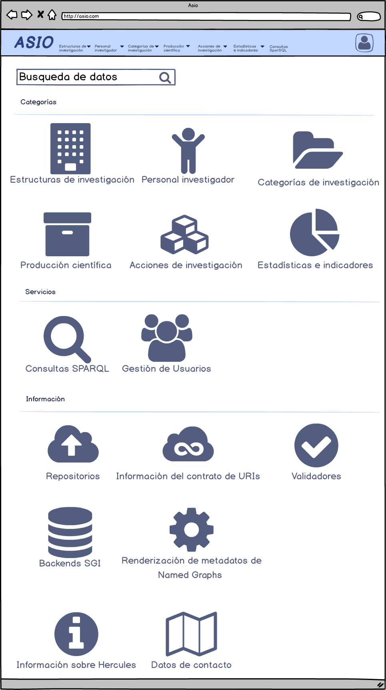
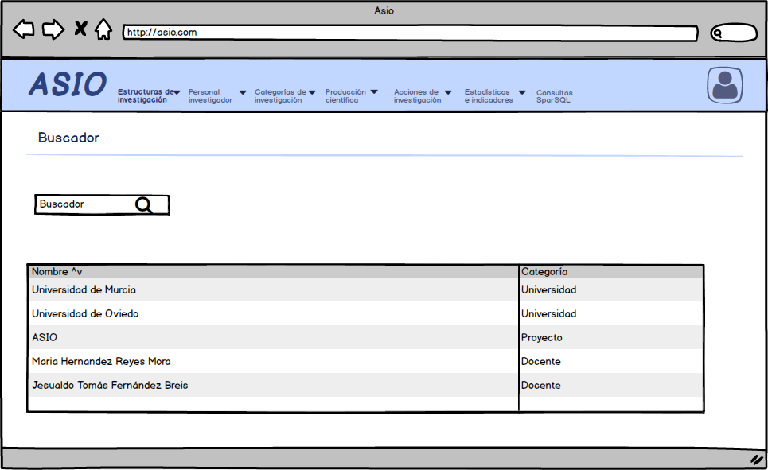
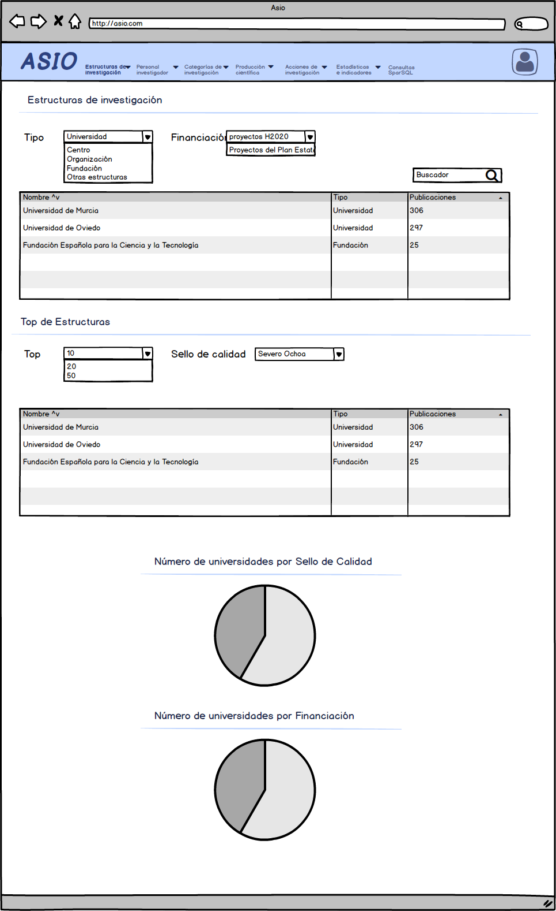
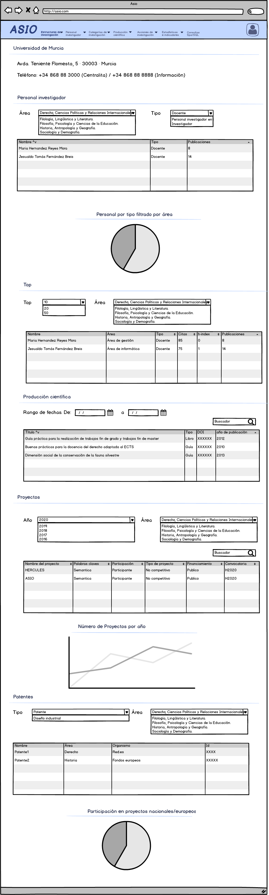
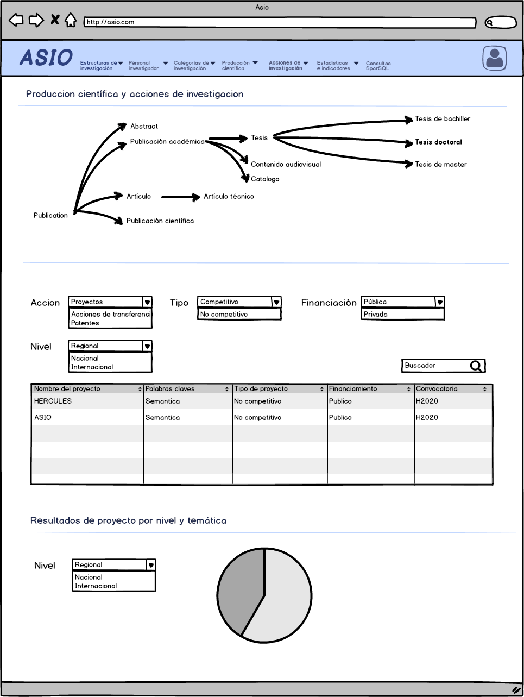
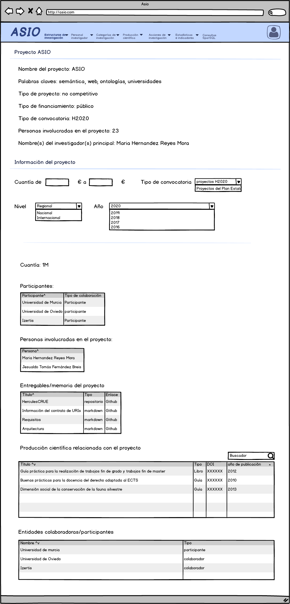

# Propuesta de solución para el front

**Índice**

[1. Home](#home)

[2. Buscador](#buscador)

[3. Centros de investigación](#centros-de-investigación)

[4. Acciones de transferencia](#acciones-de-transferencia)

[5. Detalle de proyecto](#detalle de proyecto)

Home
============

El home de la web dispondrá de un menú superior con los accesos a las diferentes categorías y a la pantalla de consultas SparQL. También se mostrarán los iconos de login/acceso o la imagen del usuario identificado. 

Dentro del propio Home se podrán ver:

- Buscador general de datos públicos
- Los servicios de los que dispone la web, como las consultas SparQL.
- Las categorías, que serían:
  - Estructuras de investigación:
    - Centros
    - Universidades
    - Fundaciones
    - Organismos
  - Personal investigador
  - Categorías:
    - Disciplinas
    - áreas
    - Líneas de investigación
    - Tópicos (topics)
  - Producción científica
    - Artículos
    - Libros
    - Congresos
  - Acciones de investigación
    - Proyectos
    - Acciones de transferencia / Startups / spinoffs
    - Patentes
  - Estadísticas e indicadores
    - Indicadores / tendencias (trends)
    - Financiación (funding) / calidad / estadísticas
    - Búsqueda de partners / estado de la técnica (state of the art)
- Al final de la página se mostrarán los enlaces a información del proyecto en general:
  - Repositorios
  - Validadores
  - Información del contrato de URIs
  - Backends SGI
  - Renderización de metadatos de Named Graphs
  - Información sobre el proyecto Hércules+
  - Datos de contacto

Buscador
===================

En la pantalla home de la aplicación se mostrará un buscador para datos públicos del dataset importado a ASIO. Este buscador constará de un único campos de texto y realizará la búsqueda en los campos de las  categorías creadas en la aplicación:

- Estructuras de investigación
- Personal investigador
- Categorías
- Producción científica
- Acciones de investigación
- Estadísticas e indicadores

Al realizar una búsqueda, la página redireccionará  a otra nueva página, donde se mostrarán los resultados en una tabla.

# Centros de investigación

En la categoría de centros de investigación, podremos ver información general sobre las diferentes estructuras de investigación:

- Centros
- Universidades
- Fundaciones
- Organismos

Se podrá acceder a ella a través de la pantalla home, o del menú superior. En el menú superior mostrará las diferentes opciones que hay dentro de las estructuras de organización: Universidad, centro, etc. Si se selecciona una de estas sub-opciones, mostrará la información filtrada por ese tipo de estructura.

La información que se mostrará en esta página tratará de responder, entre otras, a las siguientes preguntas de competencia:

| Pregunta de competencia                                      |
| ------------------------------------------------------------ |
| CQ01. Como usuario requiero obtener un listado de los centros/estructuras de investigación que trabajan en un área/disciplina específica |
| CQ04. Como usuario requiero obtener el Top 10 (o el número que se considere relevante pues será parametrizable) de centros/estructuras de investigación que posean sellos de calidad asociados, por ejemplo: el sello Severo Ochoa. |
| CQ05. Como usuario requiero obtener un listado de los centros/estructuras de investigación que hayan realizado proyectos H2020 y/o proyectos del Plan Estatal. |
| CQ12. Como usuario necesito conocer el porcentaje de participación de un centro/estructura de investigación en proyectos nacionales o europeos. |

## Detalle de centro de investigación

Pulsando sobre un centro de investigación en la pantalla de esta categoría, la web nos redirigirá a la información de ese centro de investigación.

En esta pantalla se responderá a las siguientes preguntas de competencia:

| Pregunta de competencia                                      |
| ------------------------------------------------------------ |
| CQ02. Como usuario requiero obtener un listado de los investigadores de un centro/estructura de investigación de un área/disciplina específica. Este listado podrá filtrarse según el tipo de investigador ya sea docente, personal investigador en formación, etc. |
| CQ03. Como usuario requiero obtener el Top 10 (o el número que se considere relevante pues será parametrizable) de los investigadores de un centro/estructura de investigación ordenados por el número de citas, número de publicaciones, h-index, etc. en un área/disciplina específica. |
| CQ06. Como usuario requiero obtener un listado de la producción científica en un determinado rango de fechas de un centro/estructura de investigación en un área/disciplina. Para cada resultado se incluirán algunos metadatos importantes de la producción como, por ejemplo, DOI, año de publicación, etc. |
| CQ09. Como usuario requiero obtener un listado de patentes, diseños industriales, etc. de un centro/estructura de investigación en un área/disciplina. |
| CQ10. Como investigador y personal no investigador de la universidad requiero obtener un listado de los proyectos adjudicados/desarrollados, de un centro/estructura de investigación, de un área/disciplina. |
| CQ12. Como usuario necesito conocer el porcentaje de participación de un centro/estructura de investigación en proyectos nacionales o europeos. |
| CQ17. Como usuario necesito obtener el listado de indicadores con su respectivo valor y unidad de medida (porcentaje, número, etc.) calculados en un periodo de tiempo, ya sea para toda la universidad o para cada centro/estructura de investigación de cada universidad. |
|                                                              |

# Acciones de investigación

Por ahora hemos categorizado las acciones de investigación en tres subcategorías:

- Proyectos
- Acciones de transferencia / Startups / spinoffs
- Patentes

Estas podrán ser seleccionables en el menú superior, o en el filtro de la propia categoría acciones de investigación.

En esta página se trata de mostrar la información de las preguntas de competencia relacionadas con proyectos. 

| Pregunta de competencia                                      |
| ------------------------------------------------------------ |
| CQ10. Como investigador y personal no investigador de la universidad requiero obtener un listado de los proyectos adjudicados/desarrollados, de un centro/estructura de investigación, de un área/disciplina, en un determinado año de búsqueda en los que se tenga acceso al detalle de al menos: ○	Nombre del proyecto ○	Palabras claves ○	Tipo de participación: coordinador o participante ○	Tipo de proyecto: competitivo o no competitivo ○	Tipo de financiamiento: público o privado. ○	Tipo de convocatoria: nacional, H2020, etc. ○	Número y listado de personas involucradas en el proyecto ○	Nombre(s) del investigador(s) principal ○	Entregables/memoria del proyecto ○	Producción científica relacionada con el proyecto ○	Entidades colaboradoras/participantes ○	Cuantía ○	etc. |
| CQ46. Estado del arte: ¿puedo ver los resultados de proyectos por temática concreta de proyectos desarrollados en la red, diferenciando a nivel regional, nacional, europeo? |
|                                                              |
|                                                              |

## Detalle de proyecto

Se responden a las siguientes preguntas de competencia, a modo consulta:

| Pregunta de competencia                                      |
| ------------------------------------------------------------ |
| CQ13. Como investigador, personal no investigador de la universidad requiero insertar/modificar los datos relacionados con los proyectos de investigación, incluyendo los entregables que se hayan generado en la fase de propuesta. El usuario tendrá acceso a esta información según el nivel de acceso que se le haya proporcionado previamente según su rol, según niveles de confidencialidad de ser el caso. Entre los datos que se proporcionarán por cada proyecto se tendrá al menos: ○	Nombre del proyecto ○	Palabras claves ○	Tipo de participación de la entidad: coordinador o participante ○	Tipo de proyecto: competitivo o no competitivo ○	Tipo de financiamiento: público o privado ○	Tipo de convocatoria: nacional, H2020, etc. ○	Número y listado de personas involucradas en el proyecto ○	Nombre(s) del investigador(s) principal ○	Entregables/memoria del proyecto ○	Producción científica relacionada con el proyecto ○	Entidades colaboradoras/participantes ○	Cuantía  |
| CQ14. Como usuario necesito una visualización [filtering] que me permita explorar la información de cada proyecto según los filtros que haya elegido, por ejemplo, por años, por tipo de convocatoria, por cuantía mayor a determinado valor, según un área/disciplina, según la ubicación geográfica, etc. |
|                                                              |
|                                                              |

