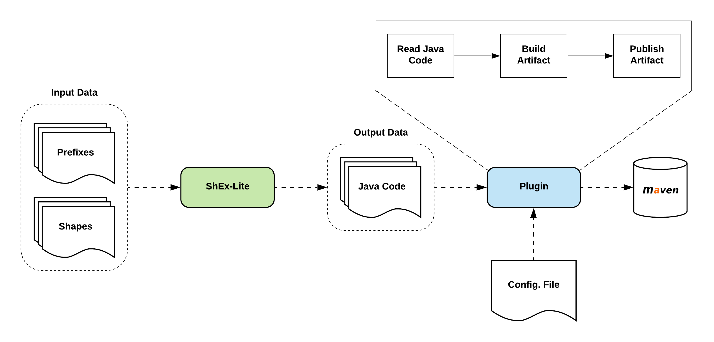

# Plugin de generación de artefactos para ShEx-Lite

## Resumen

Este plugin para ShEx-Lite permitiría que, automáticamente, se transforma la salida de ShEx-Lite de POJOs escritos en código Java plano a artefactos de Java compilados que puedan distribuirse.

ShEx-Lite es una aplicación que permite generar clases Java (POJOs) que representan un modelo de dominio. El sistema Hércules ASIO emplea ShEx-Lite para generar los modelos de dominio de la Arquitectura Semántica. Para tal fin se propone que los modelos de dominio correspondientes a cada versión de la ontología se puedan distribuir también compilados. De esta forma se pueden configurar instantáneas del proyecto. Una instantánea está compuesta por la ontología, sus shapes y el modelo de dominio correspondiente. La ontología se versiona por medio de GitHub. Sin embargo esto no se puede llevar al modelo de dominio compilado. Para versionar los artefactos es recomendable emplear un repositorio de artefactos como Maven o GitHub Packages.

## Diagrama del plugin

En el diagrama anterior se puede ver que el plugin recibe los datos de salida de ShEx-Lite. A partir de ahí empieza el proceso de creación y subida del artefacto a un repositorio de artefactos tipo Maven o GitHub packages. A demás el plugin recibe un archivo de configuración en el que se especifican las credenciales y dirección para poder desplegar el artefacto en el repositorio.

## Datos de entrada

Los datos de entrada del plugin son las clases Java que genera ShEx-Lite. Estas clases Java se encuentran como texto plano o código fuente. ShEx-Lite las genera todas en un mismo directorio pre-configurado.

## Datos de salida

Los datos de salida del plugin, para este caso, se corresponden con una versión del artefacto de modelo de dominio subida a un repositorio de artefactos, como Maven o GitHub Packages con el versionado correcto.

## Posibles impedimentos

Dentro del ámbito de posibles impedimentos se enmarcan también los patrones de diseño que puedan bloquear decisiones futuras como el conocido "vendor-lock". En este caso el único impedimento que se halla es el de que si se implementa de forma incorrecta puede resultar complicado cambiar el tipo de repositorio a donde se sube el artefacto.